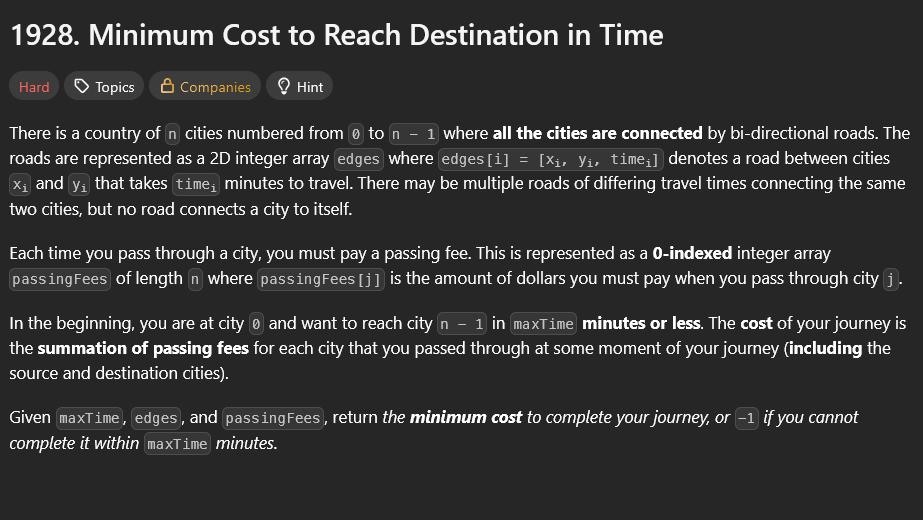
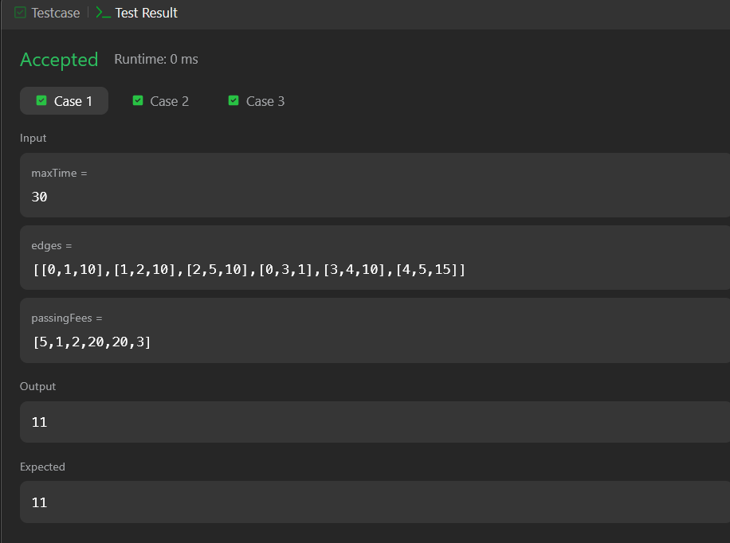
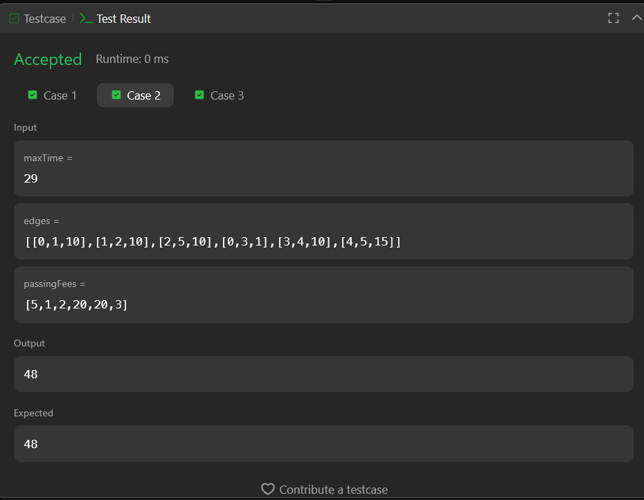
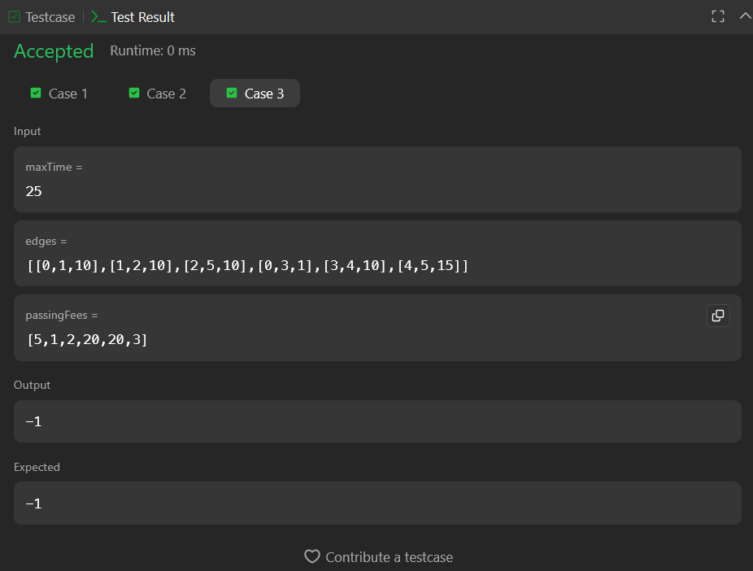

## A questão

O problema envolve encontrar o menor custo possível para viajar da
cidade `0` até a cidade `n - 1`, respeitando um limite máximo de tempo
(`maxTime`). Cada cidade possui uma taxa obrigatória (passing fee) que
deve ser paga ao passar por ela, e cada estrada possui um tempo
específico de deslocamento entre duas cidades.

O objetivo é retornar o menor custo total da viagem dentro do limite de
tempo permitido ou `-1` caso não exista caminho viável.

## Estratégia

As cidades e estradas foram modeladas como um **grafo não direcionado**,
seguindo os conceitos apresentados no material:

-   **Vértices:** representam as cidades.
-   **Arestas:** representam as estradas, com pesos equivalentes ao
    tempo necessário para percorrê-las.

Este problema exige considerar **tempo e custo simultaneamente**, o que
não pode ser resolvido apenas com uma busca simples. Por isso, tratamos
o tempo como parte do *estado* do caminho, mantendo uma tabela que
registra o menor custo possível para cada combinação
`(cidade, tempo gasto)`.

A abordagem utilizada segue princípios de algoritmos de caminhos
mínimos, adaptada para verificar múltiplos estados de uma mesma cidade.

## Algoritmo utilizado - Caminho mínimo com estado (cidade + tempo)

O algoritmo segue estes passos:

1.  **Construção do grafo** usando lista de adjacência.
2.  **Criação de uma matriz `melhor[cidade][tempo]`**, armazenando o
    menor custo encontrado para alcançar cada cidade gastando exatamente
    aquele tempo.
3.  **Uso de uma fila de prioridade (heap)** para expandir primeiro o
    estado de menor custo.
4.  **Relaxamento das arestas:**
    -   Para cada cidade atual, o algoritmo calcula o tempo e custo para
        visitar seus vizinhos.\
    -   Só são considerados caminhos cujo tempo total não ultrapassa
        `maxTime`.\
    -   Se o novo custo for melhor que o registrado, ele é atualizado e
        inserido na fila.
5.  Ao final, é retornado o menor custo entre todos os tempos válidos
    para a cidade destino.

## Resultado

A solução passou nos testes, conforme mostram as imagens abaixo:

\

