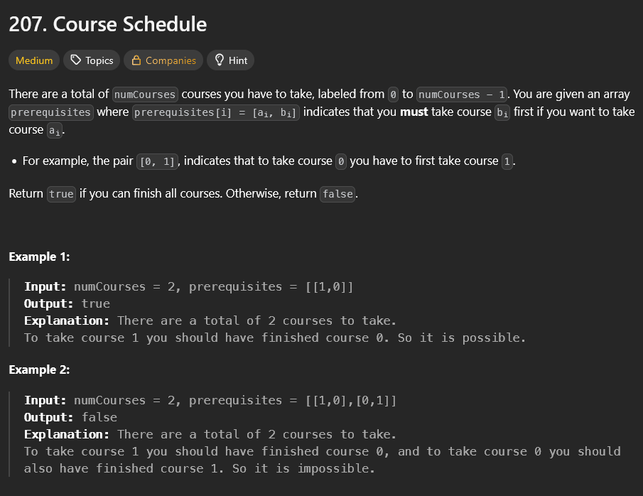
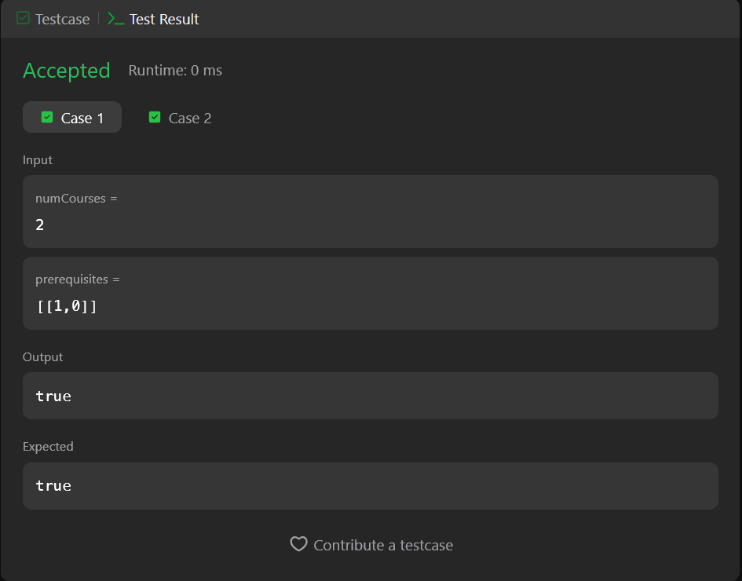
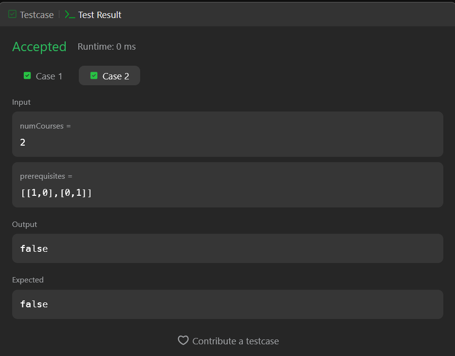

## A questão

A questão consiste em determinar se é possível completar todas as disciplinas de um curso, dadas as relações de pré-requisitos entre elas. Cada disciplina é representada por um número de 0 a numCourses - 1.
O array prerequisites contém pares [a, b] indicando que para cursar a disciplina a, é necessário ter cursado antes a disciplina b. O objetivo é retornar true caso seja possível concluir todas as disciplinas ou false caso exista dependência circular.

## Estratégia

Para resolver o problema, foi modelado as disciplinas e suas relações como um grafo direcionado, onde:

- Cada disciplina é um vértice.
- Um pré-requisito b -> a representa uma aresta dirigida de b para a.

A ideia central é verificar se esse grafo possui ciclo. Se houver ciclo, existem dependências circulares impossíveis de satisfazer, logo não é possível concluir o curso.

Para isso, utilizamos o algoritmo de ordenação de Kahn, que identifica ciclos analisando o grau de entrada dos vértices.

## Algoritmo utilizado — Ordenação Topológica (Kahn)

O algoritmo de Kahn é utilizado para gerar uma ordenação topológica de um grafo dirigido acíclico.
Ele funciona progressivamente removendo vértices sem dependências (grau 0) e atualizando o grau de entrada dos vértices restantes.

## Resultado

A solução passou nos testes, conforme atesta a imagem a seguir.

