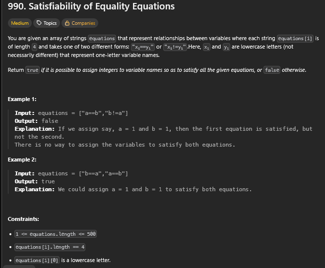

# A questão

É um desafio que pede para verificar se um conjunto de **equações de igualdade e desigualdade entre variáveis** pode ser satisfeito simultaneamente.  

Cada variável (como `a`, `b`, `c`...) representa um **nó**, e as equações formam **relações de igualdade (`==`)** ou **desigualdade (`!=`)** entre esses nós.  

O problema é determinar se existe uma forma de atribuir valores às variáveis sem violar nenhuma das condições impostas.

---

# Estratégia

A solução utiliza a estrutura **Union-Find (Disjoint Set Union - DSU)** para agrupar variáveis que devem ser iguais.  
- Cada variável pertence a um conjunto identificado por um “representante” (ou **pai**).  
- Ao encontrar uma equação `a==b`, unimos os conjuntos de `a` e `b`.  
- Depois, verificamos se há alguma contradição nas desigualdades `a!=b`:  
   - Se `a` e `b` estiverem no mesmo conjunto, há conflito, e retornamos `False`.

Essa abordagem trata o problema como um **grafo não direcionado**, onde as conexões de igualdade formam **componentes conexos**.

---

# Algoritmo utilizado

- **Estrutura de dados:** Union-Find com compressão de caminho e balanceamento por rank.  
- **Etapas principais:**
  1. Inicializar `parent` e `rank` para todas as variáveis encontradas.  
  2. **Primeira passagem:** processar todas as igualdades (`==`) e unir os conjuntos correspondentes.  
  3. **Segunda passagem:** verificar as desigualdades (`!=`), retornando `False` se dois elementos pertencem ao mesmo grupo.  
  4. Se nenhuma contradição for encontrada, retornar `True`.

---

# Resultado

A solução é eficiente e elegante, pois cada operação de união e busca ocorre em tempo quase constante (O(α(n))).  
Isso permite resolver até 500 equações de forma rápida e consistente, garantindo a validade das relações entre variáveis.

